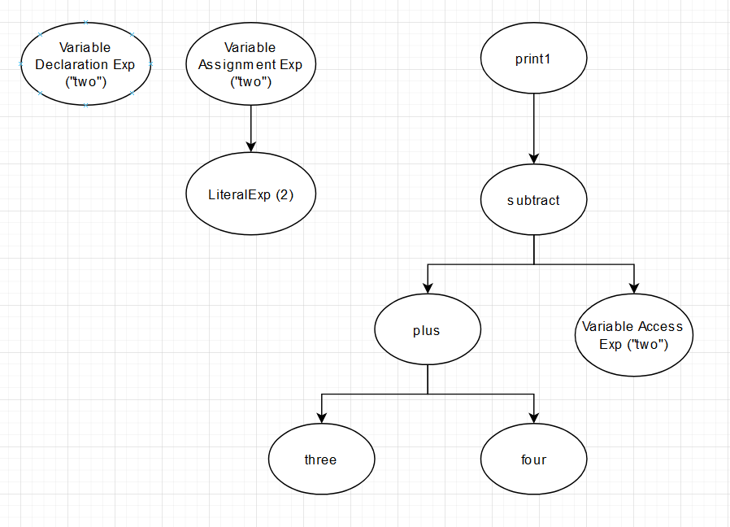
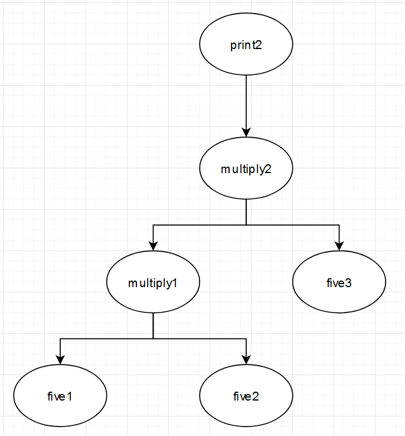
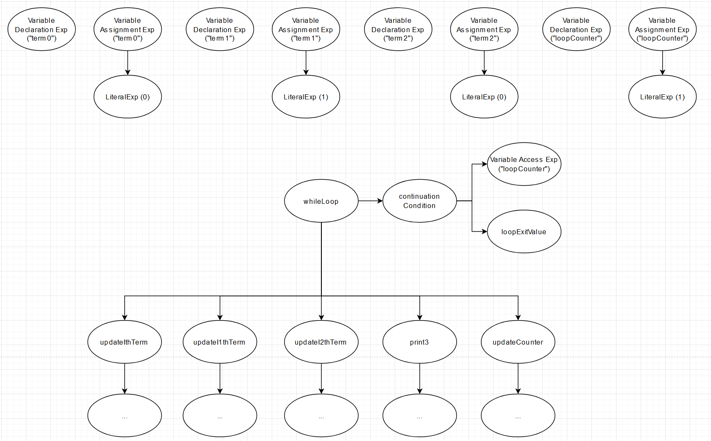

#Classes:

## Expression

An expression is some basic unit of work. All expressions are subclasses of the interface `Expression` which just provides one method `evaluate()`. Evaluate takes an environment (see below) as an argument which it may use to look up a value it needs.

That method returns a `std::any` which is able to hold any value, including nothing. This supports the dynamic typing of variables in our interpretor. See these resources for more info on `std::any` ([CPPReference](https://en.cppreference.com/w/cpp/utility/any), [Microsoft](https://devblogs.microsoft.com/cppblog/stdany-how-when-and-why/)).

An expression can have any number of children which it can evaluate recursively to support complex behavior. For instance an `ArithmeticBinaryExpression` will first evaluate its two child expressions then add, subtract, multiply, etc. the results. It's important to note that its children are store as `std::unique_ptr`s. This ensures that the parent owns its children and that they are deleted from the heap when it stops existing.

A selection of subclasses:
- `LiteralExp`: Will return a stored value.
- `VariableAccessExp`: Will look up a variable in the current environment and return it.
- `WhileLoopExp`: Will continually evaluate its children until its condition expression evaluates as false.

Please look through the header/implementation for more examples.

## Environment

An `Environment` stores variables. A variable is considered a pair composed of a name (`std::string`) and a value (`std::any`). An `Environment` has a pointer (non-owning) to its enclosing `Environment`. This construct supports scoping and variable shadowing. In simple terms, it allows for a variable to override another variable with the same name in a given block. See [this](https://craftinginterpreters.com/statements-and-state.html#environments) for more information on the principles behind it. The `ScopeChangeExpression` is reponsible for creating a new environment for this purpose. 

When a game is created it has an `Environment` *without* an enclosing `Environment`. This can be thought of as the global `Environment` storing global variables. It's where we can store `SocialGaming` variables and constants.

## Game

A `Game` is used to store a game's state and behavior. Right now, it's fairly barebones. It has a global `Environment` and a list of `Expression`s that represent its rules. If you `run()` a game it will execute each of its `Expression`s in order.  

# Example programs:

## Example 1:

This example evalautes and prints the result of "3 + 4 - 2". It creates some `LiteralExp`s to store values. It also declares and sets the value of a variable. It then adds two literals together with an `ArithmeticBinaryExp`. It then subtracts the variable from the result. Lastly, it uses a `PrintExp` to return the value. Note that only three `Expression`s are added to the `Game`'s list, the variable declaration, the variable value assignment and the `PrintExp`. All other `Expression`s created are children of the `PrintExp`.

## Example 2

This example evaluates and prints "5 * 5 * 5". It is basically the same as above.

## Example 3

This example computes 10 fibonacci numbers. It's too complex to describe step by step and the diagram has been condensed (children of the loop's children are not shown). The point of interest is that the loop has its own `std::vector` of `unique_ptr<Expressions>`s which it `evaluate()`s one after another just like a `Game` does.

# Design notes

## Interpreter vs. visitor pattern

The book I've been referencing, Crafting Interpreters, uses the visitor pattern for `Expression`s. I decided to go with the interpreter pattern instead. The main advantage of the interpreter pattern compared to the visitor pattern is its simplicity. It's much easier to understand how things are being evaluated. However, it does make it harder to expand upon the class, for instance, with things like a printer or serializer. I thought this tradeoff is reasonable since I don't expect the `Expression` class to need many new methods. If it does, we can consider switching patterns. 

## Expandability

This design supports adding new behavior to the interpreter very easily by inheriting from the interface. Here are some guidelines for doing so:
- An expression should own its children with a `unique_ptr`.
- `evaluate()` methods should probably be relatively simple. If you find yourself creating 100+ lines for one evaluate implementation it would be best to seperate that behavior into another class and call a method from it from an `Expression` instead. This would make sense for handling sending messages to players or concurrency/parallelism.
- If the `Expression` shouldn't return anything you can return an empty `std::any`.

## Parallelism

There are two seperate sources of parallelism in the project:
- Server level parallelism: multiple games need to be run at once.
- Game level parallelism: `parallel for each` and `in parallel` expressions both specify `Expression`s that need to be run at the same time.

Server level parallelism can be handled by executing multiple games at once. It is beyond the scope of the current demo's code. Game level parallelism can be handled with specialized `Expression`s that know to execute their children in parallel. I believe the Boost ASIO has capabilities to enable both types but more research still needs to be done. 

## TODOs:

- Currently there is no exception throwing/handling. We will need to implement custom exceptions and a handler to make sure an error in one game does not crash the entire program.
- More robust type handling needs to be implemented. This can be enabled with `std::any::type`.
- Unit tests. Lots of unit tests.
- Lots more `Expression` types need to be added still:
	- List methods such as shuffle
	- Client to server communication
	- Parallelism

